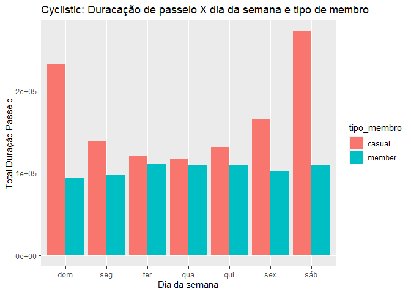
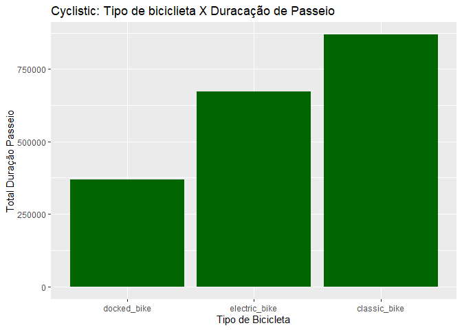
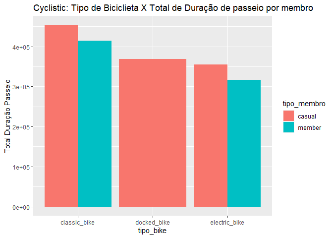
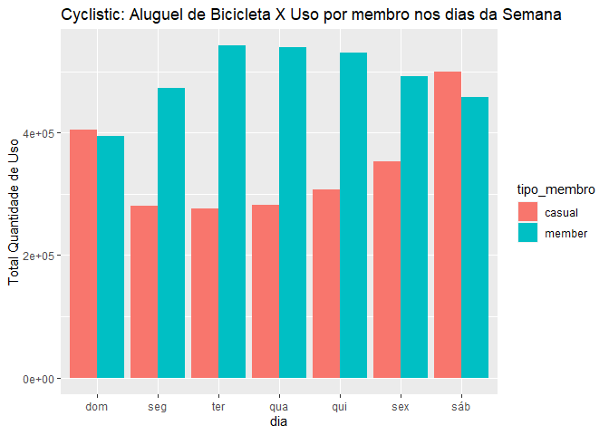
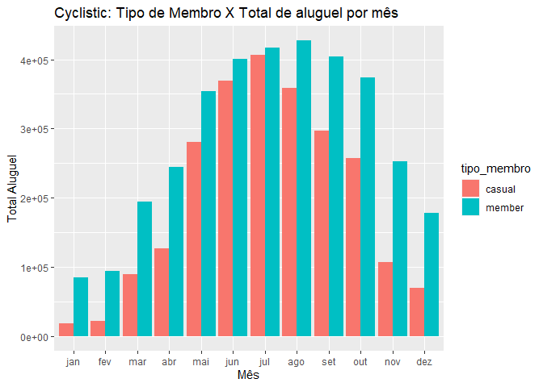
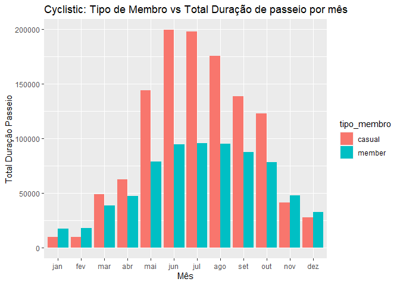
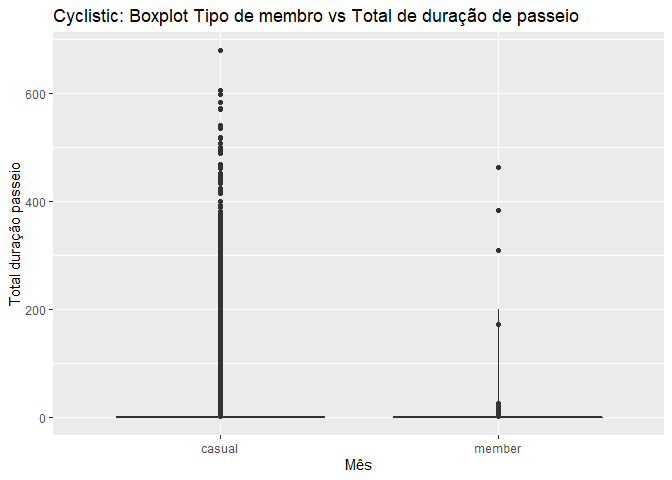

Estudo de caso - Cyclistic
================

## Estudo de casos - Cyclistic - Google Certificado - Analista de Dados

## Cenário

Você é um analista de dados júnior que trabalha na equipe de analistas
de marketing da Cyclistic, uma empresa de compartilhamento de bicicletas
em Chicago. O diretor de marketing acredita que o sucesso futuro da
empresa depende da maximização do número de planos anuais contratados.
Portanto, sua equipe quer entender como os ciclistas casuais e os
membros anuais usam as bicicletas da Cyclistic de forma diferente. A
partir desses insights, sua equipe criará uma nova estratégia de
marketing para converter passageiros casuais em membros anuais. Mas,
primeiro, os executivos da Cyclistic devem aprovar suas recomendações
que, portanto, devem ser apoiadas com insights de dados convincentes e
visualizações de dados profissionais.

## Personagens e equipes

● Cyclistic: Um programa de compartilhamento de bicicletas que conta com
mais de 5.800 bicicletas e 600 estações de compartilhamento. A Cyclistic
se diferencia por também oferecer bicicletas reclináveis, triciclos
manuais e bicicletas de carga, tornando o compartilhamento de bicicletas
mais inclusivo para pessoas com deficiência e ciclistas que não podem
usar uma bicicleta padrão de duas rodas. A maioria dos ciclistas opta
por bicicletas tradicionais; cerca de 8% dos motociclistas usam as
opções assistivas. Os usuários da Cyclistic são mais propensos a pedalar
por lazer, mas cerca de 30% utilizam as bicicletas para se deslocarem ao
trabalho diariamente. ● Lily Moreno: Diretora de marketing e sua
gerente. Lily é responsável pelo desenvolvimento de campanhas e
iniciativas de promoção do programa de compartilhamento de bicicletas.
As campanhas podem incluir e-mail, mídias sociais e outros canais. ●
Equipe de análise de marketing da Cyclistic: Uma equipe de analistas de
dados responsáveis por coletar, analisar e relatar dados que ajudam a
orientar a estratégia de marketing da Cyclistic. Você se juntou a essa
equipe há seis meses e tem estado ocupado aprendendo sobre a missão e os
objetivos de negócios da Cyclistic – e como você, como analista de dados
júnior, também pode ajudar a Cyclistic a alcançá-los. ● Equipe executiva
da Cyclistic: A equipe executiva notoriamente detalhista decidirá se
aprova o programa de marketing recomendado.

## Perguntar

Três perguntas nortearão o futuro programa de marketing: 1. Como os
membros anuais e os ciclistas casuais usam as bicicletas da Cyclistic de
forma diferente? 2. Por que os passageiros casuais iriam querer adquirir
planos anuais da Cyclistic? 3. Como a Cyclistic pode usar a mídia
digital para influenciar os passageiros casuais a se tornarem membros?

Abaixo segue análise de dados feita para o estudo de caso.

## Carregando os Dados e Bibliotecas

``` r
## Carregando as bibliotecas ##
library(tidyverse)
library(readxl)
library(dplyr)
library(ggplot2)
library(tidyr)
library(lubridate)
library(skimr)
library(readr)
```

``` r
## Analisando os tipos de dados
str(cyclistic_01)
```

    ## tibble [631,226 × 15] (S3: tbl_df/tbl/data.frame)
    ##  $ ride_id           : chr [1:631226] "620BC6107255BF4C" "4471C70731AB2E45" "26CA69D43D15EE14" "362947F0437E1514" ...
    ##  $ rideable_type     : chr [1:631226] "electric_bike" "electric_bike" "electric_bike" "electric_bike" ...
    ##  $ started_at        : POSIXct[1:631226], format: "2021-10-22 12:46:42" "2021-10-21 09:12:37" ...
    ##  $ ended_at          : POSIXct[1:631226], format: "2021-10-22 12:49:50" "2021-10-21 09:14:14" ...
    ##  $ duracao_passeio   : POSIXct[1:631226], format: "1899-12-31 00:03:08" "1899-12-31 00:01:37" ...
    ##  $ dia_da_semana     : num [1:631226] 6 5 7 7 4 5 5 4 5 4 ...
    ##  $ start_station_name: chr [1:631226] "Kingsbury St & Kinzie St" NA NA NA ...
    ##  $ start_station_id  : chr [1:631226] "KA1503000043" NA NA NA ...
    ##  $ end_station_name  : chr [1:631226] NA NA NA NA ...
    ##  $ end_station_id    : chr [1:631226] NA NA NA NA ...
    ##  $ start_lat         : chr [1:631226] "4.1889186333333296E+16" "41.93" "41.92" "41.92" ...
    ##  $ start_lng         : chr [1:631226] "-8763849533333330" "-87.7" "-87.7" "-87.69" ...
    ##  $ end_lat           : chr [1:631226] "41.89" "41.93" "41.94" "41.92" ...
    ##  $ end_lng           : chr [1:631226] "-87.63" "-87.71" "-87.72" "-87.69" ...
    ##  $ member_casual     : chr [1:631226] "member" "member" "member" "member" ...

``` r
str(cyclistic_02)
```

    ## tibble [359,920 × 15] (S3: tbl_df/tbl/data.frame)
    ##  $ ride_id           : chr [1:359920] "7C00A93E10556E47" "90854840DFD508BA" "0A7D10CDD144061C" "2F3BE33085BCFF02" ...
    ##  $ rideable_type     : chr [1:359920] "electric_bike" "electric_bike" "electric_bike" "electric_bike" ...
    ##  $ started_at        : POSIXct[1:359920], format: "2021-11-27 13:27:38" "2021-11-27 13:38:25" ...
    ##  $ ended_at          : POSIXct[1:359920], format: "2021-11-27 13:46:38" "2021-11-27 13:56:10" ...
    ##  $ duracao_passeio   : POSIXct[1:359920], format: "1899-12-31 00:19:00" "1899-12-31 00:17:45" ...
    ##  $ dia_da_semana     : num [1:359920] 7 7 6 7 6 6 7 7 7 7 ...
    ##  $ start_station_name: chr [1:359920] NA NA NA NA ...
    ##  $ start_station_id  : chr [1:359920] NA NA NA NA ...
    ##  $ end_station_name  : chr [1:359920] NA NA NA NA ...
    ##  $ end_station_id    : chr [1:359920] NA NA NA NA ...
    ##  $ start_lat         : chr [1:359920] "41.93" "41.96" "41.96" "41.94" ...
    ##  $ start_lng         : chr [1:359920] "-87.72" "-87.7" "-87.7" "-87.79" ...
    ##  $ end_lat           : chr [1:359920] "41.96" "41.92" "41.96" "41.93" ...
    ##  $ end_lng           : chr [1:359920] "-87.73" "-87.7" "-87.7" "-87.79" ...
    ##  $ member_casual     : chr [1:359920] "casual" "casual" "casual" "casual" ...

``` r
str(cyclistic_06)
```

    ## tibble [284,042 × 15] (S3: tbl_df/tbl/data.frame)
    ##  $ ride_id           : chr [1:284042] "47EC0A7F82E65D52" "8494861979B0F477" "EFE527AF80B66109" "9F446FD9DEE3F389" ...
    ##  $ rideable_type     : chr [1:284042] "classic_bike" "electric_bike" "classic_bike" "classic_bike" ...
    ##  $ started_at        : POSIXct[1:284042], format: "2022-03-21 13:45:01" "2022-03-16 09:37:16" ...
    ##  $ ended_at          : POSIXct[1:284042], format: "2022-03-21 13:51:18" "2022-03-16 09:43:34" ...
    ##  $ duracao_passeio   : POSIXct[1:284042], format: "1899-12-31 00:06:17" "1899-12-31 00:06:18" ...
    ##  $ dia_da_semana     : num [1:284042] 2 4 4 3 2 2 5 7 5 6 ...
    ##  $ start_station_name: chr [1:284042] "Wabash Ave & Wacker Pl" "Michigan Ave & Oak St" "Broadway & Berwyn Ave" "Wabash Ave & Wacker Pl" ...
    ##  $ start_station_id  : chr [1:284042] "TA1307000131" "13042" "13109" "TA1307000131" ...
    ##  $ end_station_name  : chr [1:284042] "Kingsbury St & Kinzie St" "Orleans St & Chestnut St (NEXT Apts)" "Broadway & Ridge Ave" "Franklin St & Jackson Blvd" ...
    ##  $ end_station_id    : chr [1:284042] "KA1503000043" "620" "15578" "TA1305000025" ...
    ##  $ start_lat         : chr [1:284042] "41886875" "4190099766666660" "41978353" "41886875" ...
    ##  $ start_lng         : chr [1:284042] "-8762603" "-8762375166666660" "-87659753" "-8762603" ...
    ##  $ end_lat           : chr [1:284042] "4188917683258" "41898203" "419840446107" "418777079559" ...
    ##  $ end_lng           : chr [1:284042] "-876385057718" "-87637536" "-876602738295" "-876353211408" ...
    ##  $ member_casual     : chr [1:284042] "member" "member" "member" "member" ...

``` r
str(cyclistic_12)
```

    ## tibble [701,339 × 15] (S3: tbl_df/tbl/data.frame)
    ##  $ ride_id           : chr [1:701339] "5156990AC19CA285" "E12D4A16BF51C274" "A02B53CD7DB72DD7" "C82E05FEE872DF11" ...
    ##  $ rideable_type     : chr [1:701339] "electric_bike" "electric_bike" "electric_bike" "electric_bike" ...
    ##  $ started_at        : POSIXct[1:701339], format: "2022-09-01 08:36:22" "2022-09-01 17:11:29" ...
    ##  $ ended_at          : POSIXct[1:701339], format: "2022-09-01 08:39:05" "2022-09-01 17:14:45" ...
    ##  $ duracao_passeio   : POSIXct[1:701339], format: "1899-12-31 00:02:43" "1899-12-31 00:03:16" ...
    ##  $ dia_da_semana     : num [1:701339] 5 5 5 5 5 5 5 5 5 5 ...
    ##  $ start_station_name: chr [1:701339] NA NA NA NA ...
    ##  $ start_station_id  : chr [1:701339] NA NA NA NA ...
    ##  $ end_station_name  : chr [1:701339] "California Ave & Milwaukee Ave" NA NA NA ...
    ##  $ end_station_id    : num [1:701339] 13084 NA NA NA NA ...
    ##  $ start_lat         : chr [1:701339] "41.93" "41.87" "41.87" "41.93" ...
    ##  $ start_lng         : chr [1:701339] "-87.69" "-87.62" "-87.62" "-87.69" ...
    ##  $ end_lat           : chr [1:701339] "41922695" "41.87" "41.87" "41.94" ...
    ##  $ end_lng           : chr [1:701339] "-87697153" "-87.62" "-87.62" "-87.67" ...
    ##  $ member_casual     : chr [1:701339] "casual" "casual" "casual" "casual" ...

## Limpeza e Tratamento dos Dados

``` r
## Convertendo os dados no mesmo tipo(chr) ##
cyclistic_12 <- mutate(cyclistic_12, end_station_id = as.character(end_station_id))
```

``` r
## Juntado os dados em um único data frame
cyclistic <- bind_rows(cyclistic_01, cyclistic_02, cyclistic_03, cyclistic_04, cyclistic_05, cyclistic_06, cyclistic_07, cyclistic_08, cyclistic_09, cyclistic_10, cyclistic_11, cyclistic_12)
```

``` r
## Analisando os tipos de dados do df cyclistic ##
str(cyclistic)
```

    ## tibble [5,828,177 × 15] (S3: tbl_df/tbl/data.frame)
    ##  $ ride_id           : chr [1:5828177] "620BC6107255BF4C" "4471C70731AB2E45" "26CA69D43D15EE14" "362947F0437E1514" ...
    ##  $ rideable_type     : chr [1:5828177] "electric_bike" "electric_bike" "electric_bike" "electric_bike" ...
    ##  $ started_at        : POSIXct[1:5828177], format: "2021-10-22 12:46:42" "2021-10-21 09:12:37" ...
    ##  $ ended_at          : POSIXct[1:5828177], format: "2021-10-22 12:49:50" "2021-10-21 09:14:14" ...
    ##  $ duracao_passeio   : POSIXct[1:5828177], format: "1899-12-31 00:03:08" "1899-12-31 00:01:37" ...
    ##  $ dia_da_semana     : num [1:5828177] 6 5 7 7 4 5 5 4 5 4 ...
    ##  $ start_station_name: chr [1:5828177] "Kingsbury St & Kinzie St" NA NA NA ...
    ##  $ start_station_id  : chr [1:5828177] "KA1503000043" NA NA NA ...
    ##  $ end_station_name  : chr [1:5828177] NA NA NA NA ...
    ##  $ end_station_id    : chr [1:5828177] NA NA NA NA ...
    ##  $ start_lat         : chr [1:5828177] "4.1889186333333296E+16" "41.93" "41.92" "41.92" ...
    ##  $ start_lng         : chr [1:5828177] "-8763849533333330" "-87.7" "-87.7" "-87.69" ...
    ##  $ end_lat           : chr [1:5828177] "41.89" "41.93" "41.94" "41.92" ...
    ##  $ end_lng           : chr [1:5828177] "-87.63" "-87.71" "-87.72" "-87.69" ...
    ##  $ member_casual     : chr [1:5828177] "member" "member" "member" "member" ...

``` r
## Analisando quantas linhas existem nos dados ##
nrow(cyclistic)
```

    ## [1] 5828177

``` r
## Analisando as dimensões dos dados ##
dim(cyclistic)
```

    ## [1] 5828177      15

``` r
## Verificando as seis primeiras linhas ##
head(cyclistic)
```

    ## # A tibble: 6 × 15
    ##   ride_id    ridea…¹ started_at          ended_at            duracao_passeio    
    ##   <chr>      <chr>   <dttm>              <dttm>              <dttm>             
    ## 1 620BC6107… electr… 2021-10-22 12:46:42 2021-10-22 12:49:50 1899-12-31 00:03:08
    ## 2 4471C7073… electr… 2021-10-21 09:12:37 2021-10-21 09:14:14 1899-12-31 00:01:37
    ## 3 26CA69D43… electr… 2021-10-16 16:28:39 2021-10-16 16:36:26 1899-12-31 00:07:47
    ## 4 362947F04… electr… 2021-10-16 16:17:48 2021-10-16 16:19:03 1899-12-31 00:01:15
    ## 5 BB731DE2F… electr… 2021-10-20 23:17:54 2021-10-20 23:26:10 1899-12-31 00:08:16
    ## 6 7176307BB… electr… 2021-10-21 16:57:37 2021-10-21 17:11:58 1899-12-31 00:14:21
    ## # … with 10 more variables: dia_da_semana <dbl>, start_station_name <chr>,
    ## #   start_station_id <chr>, end_station_name <chr>, end_station_id <chr>,
    ## #   start_lat <chr>, start_lng <chr>, end_lat <chr>, end_lng <chr>,
    ## #   member_casual <chr>, and abbreviated variable name ¹​rideable_type
    ## # ℹ Use `colnames()` to see all variable names

``` r
## Verificando as seis primeiras linhas ##
head(cyclistic)
```

    ## # A tibble: 6 × 15
    ##   ride_id    ridea…¹ started_at          ended_at            duracao_passeio    
    ##   <chr>      <chr>   <dttm>              <dttm>              <dttm>             
    ## 1 620BC6107… electr… 2021-10-22 12:46:42 2021-10-22 12:49:50 1899-12-31 00:03:08
    ## 2 4471C7073… electr… 2021-10-21 09:12:37 2021-10-21 09:14:14 1899-12-31 00:01:37
    ## 3 26CA69D43… electr… 2021-10-16 16:28:39 2021-10-16 16:36:26 1899-12-31 00:07:47
    ## 4 362947F04… electr… 2021-10-16 16:17:48 2021-10-16 16:19:03 1899-12-31 00:01:15
    ## 5 BB731DE2F… electr… 2021-10-20 23:17:54 2021-10-20 23:26:10 1899-12-31 00:08:16
    ## 6 7176307BB… electr… 2021-10-21 16:57:37 2021-10-21 17:11:58 1899-12-31 00:14:21
    ## # … with 10 more variables: dia_da_semana <dbl>, start_station_name <chr>,
    ## #   start_station_id <chr>, end_station_name <chr>, end_station_id <chr>,
    ## #   start_lat <chr>, start_lng <chr>, end_lat <chr>, end_lng <chr>,
    ## #   member_casual <chr>, and abbreviated variable name ¹​rideable_type
    ## # ℹ Use `colnames()` to see all variable names

``` r
## Verificando o sumário dos dados - cyclistic ##
skim_without_charts(cyclistic)
```

|                                                  |           |
|:-------------------------------------------------|:----------|
| Name                                             | cyclistic |
| Number of rows                                   | 5828177   |
| Number of columns                                | 15        |
| \_\_\_\_\_\_\_\_\_\_\_\_\_\_\_\_\_\_\_\_\_\_\_   |           |
| Column type frequency:                           |           |
| character                                        | 11        |
| numeric                                          | 1         |
| POSIXct                                          | 3         |
| \_\_\_\_\_\_\_\_\_\_\_\_\_\_\_\_\_\_\_\_\_\_\_\_ |           |
| Group variables                                  | None      |

Data summary

**Variable type: character**

| skim_variable      | n_missing | complete_rate | min | max | empty | n_unique | whitespace |
|:-------------------|----------:|--------------:|----:|----:|------:|---------:|-----------:|
| ride_id            |         0 |          1.00 |  13 |  23 |     0 |  5828177 |          0 |
| rideable_type      |         0 |          1.00 |  11 |  13 |     0 |        3 |          0 |
| start_station_name |    895023 |          0.85 |   7 |  64 |     0 |     1591 |          0 |
| start_station_id   |    895023 |          0.85 |   3 |  44 |     0 |     1302 |          0 |
| end_station_name   |    958207 |          0.84 |   9 |  64 |     0 |     1609 |          0 |
| end_station_id     |   1277817 |          0.78 |   2 |  44 |     0 |     1334 |          0 |
| start_lat          |         0 |          1.00 |   4 |  22 |     0 |   601241 |          0 |
| start_lng          |         0 |          1.00 |   5 |  17 |     0 |   569539 |          0 |
| end_lat            |      5844 |          1.00 |   4 |  22 |     0 |   217889 |          0 |
| end_lng            |      5844 |          1.00 |   5 |  17 |     0 |   207369 |          0 |
| member_casual      |         0 |          1.00 |   6 |   6 |     0 |        2 |          0 |

**Variable type: numeric**

| skim_variable | n_missing | complete_rate | mean |   sd |  p0 | p25 | p50 | p75 | p100 |
|:--------------|----------:|--------------:|-----:|-----:|----:|----:|----:|----:|-----:|
| dia_da_semana |         0 |             1 | 4.12 | 2.02 |   1 |   2 |   4 |   6 |    7 |

**Variable type: POSIXct**

| skim_variable   | n_missing | complete_rate | min                 | max                 | median              | n_unique |
|:----------------|----------:|--------------:|:--------------------|:--------------------|:--------------------|---------:|
| started_at      |         0 |             1 | 2021-10-01 00:00:09 | 2022-09-30 23:59:56 | 2022-06-08 06:42:52 |  4875111 |
| ended_at        |         0 |             1 | 2021-10-01 00:03:11 | 2022-10-05 19:53:11 | 2022-06-08 06:57:05 |  4884734 |
| duracao_passeio |         0 |             1 | 1899-12-31 00:00:00 | 1900-01-28 06:25:01 | 1899-12-31 00:10:29 |    22647 |

``` r
## Criando um novo nome para o df e nova coluna para Calcular a duração de horas por passeio ##
cycli <- cyclistic %>%
  mutate(duracao_passeio = difftime(ended_at, started_at, units = "hours"))
```

``` r
## Selecionado colunas para análise ##
cycli <- cycli %>%
  select(ride_id, rideable_type, started_at, ended_at, duracao_passeio, dia_da_semana, start_station_name, end_station_name, member_casual)
```

``` r
## verificando os dados do df cycli ##
str(cycli)
```

    ## tibble [5,828,177 × 9] (S3: tbl_df/tbl/data.frame)
    ##  $ ride_id           : chr [1:5828177] "620BC6107255BF4C" "4471C70731AB2E45" "26CA69D43D15EE14" "362947F0437E1514" ...
    ##  $ rideable_type     : chr [1:5828177] "electric_bike" "electric_bike" "electric_bike" "electric_bike" ...
    ##  $ started_at        : POSIXct[1:5828177], format: "2021-10-22 12:46:42" "2021-10-21 09:12:37" ...
    ##  $ ended_at          : POSIXct[1:5828177], format: "2021-10-22 12:49:50" "2021-10-21 09:14:14" ...
    ##  $ duracao_passeio   : 'difftime' num [1:5828177] 0.0522222222222222 0.0269444444444444 0.129722222222222 0.0208333333333333 ...
    ##   ..- attr(*, "units")= chr "hours"
    ##  $ dia_da_semana     : num [1:5828177] 6 5 7 7 4 5 5 4 5 4 ...
    ##  $ start_station_name: chr [1:5828177] "Kingsbury St & Kinzie St" NA NA NA ...
    ##  $ end_station_name  : chr [1:5828177] NA NA NA NA ...
    ##  $ member_casual     : chr [1:5828177] "member" "member" "member" "member" ...

``` r
## verificando o sumário dos dados - cycli ##
skim(cycli)
```

|                                                  |         |
|:-------------------------------------------------|:--------|
| Name                                             | cycli   |
| Number of rows                                   | 5828177 |
| Number of columns                                | 9       |
| \_\_\_\_\_\_\_\_\_\_\_\_\_\_\_\_\_\_\_\_\_\_\_   |         |
| Column type frequency:                           |         |
| character                                        | 5       |
| difftime                                         | 1       |
| numeric                                          | 1       |
| POSIXct                                          | 2       |
| \_\_\_\_\_\_\_\_\_\_\_\_\_\_\_\_\_\_\_\_\_\_\_\_ |         |
| Group variables                                  | None    |

Data summary

**Variable type: character**

| skim_variable      | n_missing | complete_rate | min | max | empty | n_unique | whitespace |
|:-------------------|----------:|--------------:|----:|----:|------:|---------:|-----------:|
| ride_id            |         0 |          1.00 |  13 |  23 |     0 |  5828177 |          0 |
| rideable_type      |         0 |          1.00 |  11 |  13 |     0 |        3 |          0 |
| start_station_name |    895023 |          0.85 |   7 |  64 |     0 |     1591 |          0 |
| end_station_name   |    958207 |          0.84 |   9 |  64 |     0 |     1609 |          0 |
| member_casual      |         0 |          1.00 |   6 |   6 |     0 |        2 |          0 |

**Variable type: difftime**

| skim_variable   | n_missing | complete_rate | min     | max          | median     | n_unique |
|:----------------|----------:|--------------:|:--------|:-------------|:-----------|---------:|
| duracao_passeio |         0 |             1 | 0 hours | 678.42 hours | 0.17 hours |    22647 |

**Variable type: numeric**

| skim_variable | n_missing | complete_rate | mean |   sd |  p0 | p25 | p50 | p75 | p100 | hist  |
|:--------------|----------:|--------------:|-----:|-----:|----:|----:|----:|----:|-----:|:------|
| dia_da_semana |         0 |             1 | 4.12 | 2.02 |   1 |   2 |   4 |   6 |    7 | ▇▃▃▃▇ |

**Variable type: POSIXct**

| skim_variable | n_missing | complete_rate | min                 | max                 | median              | n_unique |
|:--------------|----------:|--------------:|:--------------------|:--------------------|:--------------------|---------:|
| started_at    |         0 |             1 | 2021-10-01 00:00:09 | 2022-09-30 23:59:56 | 2022-06-08 06:42:52 |  4875111 |
| ended_at      |         0 |             1 | 2021-10-01 00:03:11 | 2022-10-05 19:53:11 | 2022-06-08 06:57:05 |  4884734 |

``` r
## Renomear colunas - cycli ##
cycli <- cycli %>%
  rename(id_aluguel=ride_id, tipo_bike=rideable_type, tipo_membro=member_casual,
         nome_estacao_final=end_station_name, nome_estacao_inicial=start_station_name)
```

``` r
## Inserido dia da semana e transformando duracao_passeio em númerico ##
cycli <- cycli %>%
  mutate(dia = wday(started_at, label = TRUE))%>%
  mutate(duracao_passeio = as.double(duracao_passeio))%>%
  mutate(cycli, duracao_passeio = as.double(duracao_passeio))
```

## Análise Descritiva

``` r
## Analisando os dados estatísticos de duração de passeio ##
skim(cycli$duracao_passeio)
```

|                                                  |                        |
|:-------------------------------------------------|:-----------------------|
| Name                                             | cycli\$duracao_passeio |
| Number of rows                                   | 5828177                |
| Number of columns                                | 1                      |
| \_\_\_\_\_\_\_\_\_\_\_\_\_\_\_\_\_\_\_\_\_\_\_   |                        |
| Column type frequency:                           |                        |
| numeric                                          | 1                      |
| \_\_\_\_\_\_\_\_\_\_\_\_\_\_\_\_\_\_\_\_\_\_\_\_ |                        |
| Group variables                                  | None                   |

Data summary

**Variable type: numeric**

| skim_variable | n_missing | complete_rate | mean |   sd |  p0 | p25 |  p50 |  p75 |   p100 | hist  |
|:--------------|----------:|--------------:|-----:|-----:|----:|----:|-----:|-----:|-------:|:------|
| data          |         0 |             1 | 0.33 | 2.87 |   0 | 0.1 | 0.17 | 0.31 | 678.42 | ▇▁▁▁▁ |

``` r
## Analisando a média, mediana, máximo e minimo de duração de passeio por membros ##
aggregate(cycli$duracao_passeio ~ cycli$tipo_membro, FUN = mean)
```

    ##   cycli$tipo_membro cycli$duracao_passeio
    ## 1            casual             0.4901119
    ## 2            member             0.2132474

``` r
aggregate(cycli$duracao_passeio ~ cycli$tipo_membro, FUN = median)
```

    ##   cycli$tipo_membro cycli$duracao_passeio
    ## 1            casual             0.2241667
    ## 2            member             0.1480556

``` r
aggregate(cycli$duracao_passeio ~ cycli$tipo_membro, FUN = max)
```

    ##   cycli$tipo_membro cycli$duracao_passeio
    ## 1            casual              678.4169
    ## 2            member              462.0039

``` r
aggregate(cycli$duracao_passeio ~ cycli$tipo_membro, FUN = min)
```

    ##   cycli$tipo_membro cycli$duracao_passeio
    ## 1            casual                     0
    ## 2            member                     0

``` r
## Analisando a média de duração de passeio nos dias da semana por membros ##
aggregate(cycli$duracao_passeio ~ cycli$tipo_membro + cycli$dia_da_semana, FUN = mean)
```

    ##    cycli$tipo_membro cycli$dia_da_semana cycli$duracao_passeio
    ## 1             casual                   1             0.5708876
    ## 2             member                   1             0.2367466
    ## 3             casual                   2             0.4980229
    ## 4             member                   2             0.2048328
    ## 5             casual                   3             0.4377846
    ## 6             member                   3             0.2055112
    ## 7             casual                   4             0.4241162
    ## 8             member                   4             0.2023948
    ## 9             casual                   5             0.4287129
    ## 10            member                   5             0.2052398
    ## 11            casual                   6             0.4655526
    ## 12            member                   6             0.2088978
    ## 13            casual                   7             0.5412794
    ## 14            member                   7             0.2375778

``` r
## Analisando o máximo de duração de passeio nos dias da semana por membros ##
aggregate(cycli$duracao_passeio ~ cycli$tipo_membro + cycli$dia_da_semana, FUN = max)
```

    ##    cycli$tipo_membro cycli$dia_da_semana cycli$duracao_passeio
    ## 1             casual                   1             604.29667
    ## 2             member                   1              24.99917
    ## 3             casual                   2             533.92417
    ## 4             member                   2              24.99917
    ## 5             casual                   3             534.43194
    ## 6             member                   3             462.00389
    ## 7             casual                   4             597.01056
    ## 8             member                   4             172.55583
    ## 9             casual                   5             517.05833
    ## 10            member                   5             170.88778
    ## 11            casual                   6             540.04944
    ## 12            member                   6              24.99944
    ## 13            casual                   7             678.41694
    ## 14            member                   7              25.99833

## Visualização dos Dados

``` r
## Analisando a quantidade total de passeio por membros e dia da semana ##
cycli %>%
  mutate(dia = wday(started_at, label = TRUE)) %>% 
  group_by(tipo_membro, dia) %>% 
  summarise(Total = sum(duracao_passeio)) %>%
  arrange(dia)%>%
  ggplot(aes(x = dia, y = Total , fill = tipo_membro)) + geom_col(position = "dodge") + labs(title = "Cyclistic: Duracação de passeio X dia da semana e tipo de membro", x ="Dia da semana", y = "Total Duração Passeio")
```

<!-- -->

``` r
## Analisando o total de passeio por bicicleta ##
cycli %>%
  group_by(tipo_bike) %>% 
  summarise(Total = sum(duracao_passeio))%>%
  ggplot(aes(x = fct_reorder(tipo_bike, Total), y = Total)) + geom_col( fill = "dark green")+ labs(title = "Cyclistic: Tipo de biciclieta X Duracação de Passeio", x ="Tipo de Bicicleta", y = "Total Duração Passeio")
```

<!-- -->

``` r
## Analisando qual é o tipo de bicicleta mais utilizado por membros ##
cycli %>%
  group_by(tipo_bike, tipo_membro) %>% 
  summarise(Total = sum(duracao_passeio))%>%
  ggplot(aes(x = tipo_bike, y = Total , fill = tipo_membro)) + geom_col(position = "dodge")+ labs(title = "Cyclistic: Tipo de Biciclieta X Total de Duração de passeio por membro", y = "Total Duração Passeio", X = "Tipo de Bicicleta" )
```

<!-- -->

``` r
## Analisando a quantidade total VS aluguel por dia ##
cycli %>%
  mutate(dia = wday(started_at, label = TRUE)) %>%
  group_by(tipo_membro, dia) %>%
  count()%>%
  arrange(dia)%>%
  ggplot(aes(x = dia, y = n , fill = tipo_membro)) + geom_col(position = "dodge")+ labs(title = "Cyclistic: Aluguel de Bicicleta X Uso por membro nos dias da Semana", y = "Total Quantidade de Uso", X = "Dia da semana")
```

<!-- -->

``` r
## Analisando a quantidade de alguel por mês e tipo de membro ##
cycli%>%
  mutate(mes = month(started_at, label = TRUE))%>%
  group_by(mes, tipo_membro)%>%
  count(tipo_membro)%>%
  arrange(mes)%>%
  ggplot(aes(x=mes, y=n, fill = tipo_membro)) + geom_col(position = "dodge")+ labs(title = "Cyclistic: Tipo de Membro X Total de aluguel por mês", y="Total Aluguel", x ="Mês")
```

<!-- -->

``` r
## Analisando a duração de passeio por mês e tipo de membro ##
cycli%>%
  mutate(mes = month(started_at, label = TRUE))%>%
  group_by(mes, tipo_membro)%>%
  summarise(Total_duracao_passeio = sum(duracao_passeio))%>%
  ggplot(aes(x=mes, y=Total_duracao_passeio, fill = tipo_membro)) + geom_col(position = "dodge")+ labs(title = "Cyclistic: Tipo de Membro vs Total Duração de passeio por mês", y="Total Duração Passeio", x ="Mês")
```

<!-- -->

``` r
## Analisando Outliers ##
cycli%>%
  ggplot(aes(x=tipo_membro, y=duracao_passeio)) + geom_boxplot(ymax = 200)+ labs(title = "Cyclistic: Boxplot Tipo de membro vs Total de duração de passeio", y="Total duração passeio", x ="Mês")
```

<!-- -->
